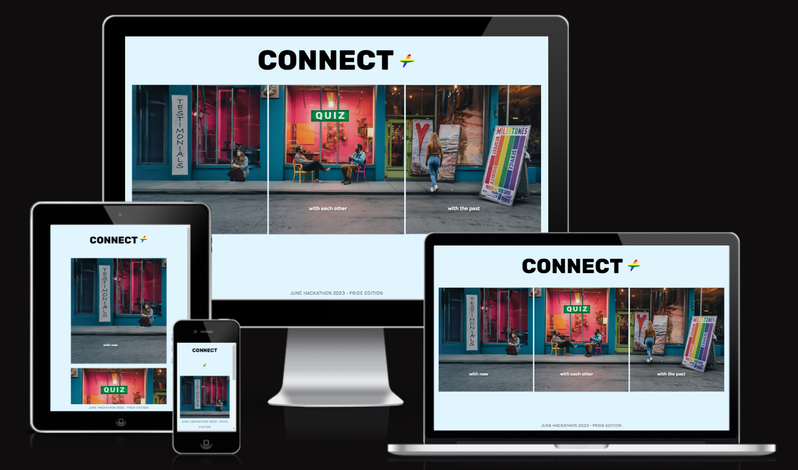

# **Connect+**

Connect+ is an inclusive application designed to empower and connect the LGBTQ+ community. Whether you're looking for an engaging podcast, exploring LGBTQ+ history, or challenging your knowledge with a fun question game, Connect+ is here to provide an enriching experience for everyone.

Live deployment link can be found [here](https://keironchaudhry.github.io/june-pride-hackathon-2023/).

# Table of Contents

1. [Project Goals](#project-goals "ProjectGoals")
2. [User Experience](#user-experience "User Experience")
   - [Target Audience](#target-audience "Target Audience")
   - [User Requirements and Expectations](#user-requirements-and-expectations "User Requirements and Expectations")
   - [User Stories](#user-stories "User Stories")
3. [Design](#design "Design")
   - [Design Choices](#design-choices "Design Choices")
   - [Colour](#colour "Colour")
   - [Fonts](#fonts "Fonts")
   - [Music & Sounds](#music--sounds "Music & Sounds")
   - [Wireframes](#wireframes "Wireframes")
4. [Technologies, Languages & Programs Used](#technologies-languages--programs-used)
5. [Features](#features "Features")
   - [Existing Features](#existing-features "Existing Features")
     - [Start Screen](#start-screen "Start Screen")
     - [Game Screen](#game-screen "Game Screen")
     - [End Screen](#end-screen "End Screen")
   - [Future Features](#future-features "Future Features")
   - [Responsiveness](#responsiveness "Responsiveness")
6. [Testing](#testing "Testing")
   - [Bugs](#bugs "Bugs")
   - [Validator Testing](#validator-testing "Validator Testing")
7. [Deployment, Development & Version Control](#deployment-development--version-control)
8. [Credits](#credits "Credits")

## **Project Goals**

Based on the Code Institute Hackathon June 2023 Theme of "Pride", create an application which follows the theme of LGBTQ+ Pride. The application should be meaningful and educative, and bring purpose and connection to the user.

## **User Experience**

Connect+ prioritises delivering a seamless and delightful user experience to ensure that our application is accessible, intuitive, and enjoyable for everyone in the LGBTQ+ community.

* **LGBTQ+ Podcast**: The application features a testimonials page where users can engage in stories and experiences as told by other people of the same community. The user is able to emotionally connect and recognise their experiences in these testimonials.

* **Milestones**: It also features an educational page where users can be exposed to current/historical figures that have had a monumental impact in the community or in history. Featured also are historical events. 

* **Conversation**: The application features a game which has been designed to produce random questions for the user. This game is to intuitively be used in person with another person, as a way of getting to know them at a deeper, human level. 

## **Target Audience**

Our target audience is everybody that is a part of the LGBTQ+ community, and even those who are allies, thus being able to educate themselves and learn about LGBTQ+ community by having exposure to the history and struggles in this domain.

## **User Stories**

To be added.

## **Design**

### **Design Choices**

To be added.

### **Colour**

To be added

 

### **Fonts**

To be added.

### **Music & Sounds**

To be added.

### **Wireframes**

To be added.

## **Technologies, Languages & Programs Used**

To be added.

## **Features**

To be added.

### **Existing Features**

To be added.

### **Responsiveness**

To be added.

## **Testing**

### **Manual Testing**

Manual testing following the User Stories was carried out throughout the development of the project, with the final results available below.

- As a **user**, I want () so that I ().

| **Test** | Issue | Result |
| -------- | ----- | ------ |
| 1        | ()    | PASS   |

## **Bugs**

### **Fixed bugs**

To find a list of fixed bugs that were mended during development, please click [here]().

### **Remaining bugs**

To be added.

## **Validator Testing**

### **HTML Validator**

The [W3C Markup Validation Service](https://validator.w3.org/) for the HTML code was passed in as a URL and returned no errors.

### **CSS Validator**

The [W3C CSS Validation Service](https://jigsaw.w3.org/css-validator/) for the CSS code was passed in as source code and returned no errors.

### **JSHint**

The [JSHint Validation Service](https://jshint.com/) for the JavaScript code was passed in as source code and returned no errors.

## **Deployment, Development & Version Control**

The development environment used for this project was GitPod.

Each software developer on the team created their own individual branch divergent from main from the get-go and have communicated via Slack to collaborate, pitch ideas, fix bugs and talk about relevant Pull Requests. Regular commits and pushes to Github have been employed to be able to track and trace the development process of the web application.

For local deployments instructions shall be written below, along with instructions with deployment to GitHub Pages, the hosting service used to deploy this particular website.

### **Local Deployment**

This repository can be cloned and run locally with the following steps:

- Login to GitHub.
- Select repository named: keironchaudhry/june-pride-hackathon-2023
- Click code toggle button and copy the url (i.e., https://github.com/keironchaudhry/june-pride-hackathon-2023.git).
- In your IDE, open the terminal and run the git clone command (i.e., git clone https://github.com/keironchaudhry/june-pride-hackathon-2023.git). The repository will now be cloned in your workspace.

### **Deployment to GitHub**

The live version of the project is deployed at GitHub pages.

The procedure for deployment followed the "Creating your site" steps provided in GitHub Docs.

- Log into Github.
- Select desired GitHub Repository to be deployed live.
- Underneath the repository name, click the “Settings” option.
- In the sub-section list on the left, under “Code and automation”, click “Pages”.
- Within the ”Source” section choose ”main” as Branch and root as folder and click ”Save”.
- The page refreshes and a website shall then deploy via a link.
- The following is the live link deployed: 

## **Credits**

### **Media**

To be added.

### **Acknowledgments**

This project was created in collaboration by [Team Symbiotic+](https://hackathon.codeinstitute.net/teams/314/): Hermon Asmelash, Iberico Alex, Keiron Chaudhry, Stephen Opoku, Sam Petchey, Samuel Ukachukwu.
