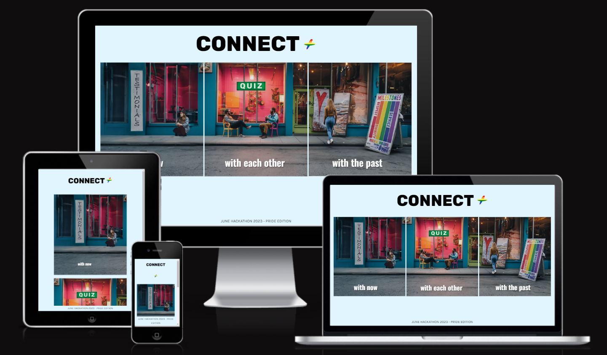

# **Connect+**

Connect+ is an inclusive application designed to empower and connect the LGBTQ+ community. Whether you're looking for an engaging podcast, exploring LGBTQ+ history, or challenging your knowledge with a fun question game, Connect+ is here to provide an enriching experience for everyone.

Live deployment link can be found [here](https://keironchaudhry.github.io/june-pride-hackathon-2023/).

# Table of Contents

1. [Project Goals](#project-goals "ProjectGoals")
2. [User Experience](#user-experience "User Experience")
   - [Target Audience](#target-audience "Target Audience")
   - [User Requirements and Expectations](#user-requirements-and-expectations "User Requirements and Expectations")
   - [User Stories](#user-stories "User Stories")
3. [Design](#design "Design")
   - [Design Choices](#design-choices "Design Choices")
   - [Colour](#colour "Colour")
   - [Fonts](#fonts "Fonts")
   - [Music & Sounds](#music--sounds "Music & Sounds")
   - [Wireframes](#wireframes "Wireframes")
4. [Technologies, Languages & Programs Used](#technologies-languages--programs-used)
5. [Features](#features "Features")
   - [Existing Features](#existing-features "Existing Features")
     - [Start Screen](#start-screen "Start Screen")
     - [Game Screen](#game-screen "Game Screen")
     - [End Screen](#end-screen "End Screen")
   - [Future Features](#future-features "Future Features")
   - [Responsiveness](#responsiveness "Responsiveness")
6. [Testing](#testing "Testing")
   - [Bugs](#bugs "Bugs")
   - [Validator Testing](#validator-testing "Validator Testing")
7. [Deployment, Development & Version Control](#deployment-development--version-control)
8. [Credits](#credits "Credits")

## **Project Goals**

Based on the Code Institute Hackathon June 2023 Theme of "Pride", create an application which follows the theme of LGBTQ+ Pride. The application should be meaningful and educative, and bring purpose and connection to the user.

## **User Experience**

Connect+ prioritises delivering a seamless and delightful user experience to ensure that our application is accessible, intuitive, and enjoyable for everyone in the LGBTQ+ community.

* **LGBTQ+ Podcast**: The application features a testimonials page where users can engage in stories and experiences as told by other people of the same community. The user is able to emotionally connect and recognise their experiences in these testimonials.

* **Milestones**: It also features an educational page where users can be exposed to current/historical figures that have had a monumental impact in the community or in history. Featured also are historical events. 

* **Conversation**: The application features a game which has been designed to produce random questions for the user. This game is to intuitively be used in person with another person, as a way of getting to know them at a deeper, human level. 

## **Target Audience**

Our target audience is everybody that is a part of the LGBTQ+ community, and even those who are allies, thus being able to educate themselves and learn about LGBTQ+ community by having exposure to the history and struggles in this domain.

## **User Stories**

As a **user**, I want **to be able to view a consistent colour scheme across the application** so that **the application and its navigation feels like a smooth transition**.

As a **user**, I want **to be able to find and access the navigation bar** so that I can **navigate around the application with ease**.

As a **user**, I want **to be able to view the footer** so that I can **view any extra beneficial information regarding the application**.

As a **user**, I want **to be able to land on the home page** so that I am **able to have a central point of contact in the application**.

As a **user**, I want **to be able to find a question game** so that I can **play it in person with another stranger to get to know them better**.

As a **user**, I want **to be able to listen to different podcasts** so that I can **engage and associate with the experiences of others**.

As a **user**, I want **to be able to view historical information** so that I can **learn and appreciate LGBTQ+ history**.

## **Design**
With a focus on minimalism and contemporary aesthetics, we made a deliberate choice to steer away from the conventional pride color scheme. Our aim was to avoid any over-the-top elements commonly associated with the LGBTQ+ community. Nevertheless, we incorporated a vibrant palette reminiscent of the colors of the pride rainbow, but with reduced opacity to ensure that unnecessary content doesn't distract attention.

Other details to note:
- The portraits featured on the Testimonials page were generated using Midjourney.
- Other visuals were obtained from reputable image stock databases such as Pexels and Envato.

### **Design Choices**

To be added.

### **Colour**
In designing the website, we made a deliberate choice to incorporate a vibrant color palette. However, we were keen on avoiding the stereotypical kitschy pride colors and instead aimed for a fresh and unique approach. To maintain a harmonious visual experience, we also decreased the opacity of the colors, ensuring a balanced and pleasing aesthetic without overwhelming or conflicting color clashes.

### **Fonts**

To be added.

### **Music & Sounds**
In order to provide an exceptional user experience and offer a realistic preview of the website's functionality, we took steps to create an immersive audio experience. For each story, we generated podcasts featuring diverse voices. These voices were recorded using specialized AI software that seamlessly converts text into speech. The audio content for each testimonial was generated using ChatGPT, where we selectively prompted the stories we wished to share.

### **Wireframes**
- Index page

- Testimonials page

- Conversation page

- Milestones page

## **Technologies, Languages & Programs Used**

* [HTML](https://www.w3schools.com/html/): Markup language for creating web pages.
* [CSS](https://www.w3schools.com/CSS/): Stylesheet language for styling the appearance of web pages.
* [JavaScript](https://www.javascript.com/): Programming language for adding interactivity to web pages.
* [Materialize](https://materializecss.com/): CSS framework for creating responsive and modern web designs.
* [GitHub](https://github.com/): Web-based platform for version control and collaboration on software projects.
* [GitHub Pages](https://pages.github.com/): Hosting service provided by GitHub for publishing static web pages.
* [Google Fonts](https://fonts.google.com/): Library of free and open-source web fonts.
* [Google Lighthouse](https://developer.chrome.com/docs/lighthouse/overview/): Automated tool for auditing and improving web page quality.
* [W3C Validator](https://validator.w3.org/): Tool for checking HTML and CSS code compliance with web standards.
* [JSHint](https://jshint.com/): Static code analysis tool for detecting errors and potential issues in JavaScript code.
* [CodeAnywhere](https://codeanywhere.com/): Cloud-based integrated development environment (IDE) for coding, collaborating, and deploying projects.
* [GitPod](https://gitpod.io/): Online IDE specifically designed for developing applications with Git repositories. It provides a fully configured development environment for each project.
* [VSCode](https://code.visualstudio.com/): Free and highly extensible source code editor with built-in features for editing, debugging, and version control integration. It supports various programming languages and is available for multiple platforms.

## **Features**

To be added.

### **Existing Features**

To be added.

### **Responsiveness**

To be added.

## **Testing**

### **Manual Testing**

Manual testing following the User Stories was carried out throughout the development of the project, with the final results available below.

- As a **user**, I want **to be able to view a consistent colour scheme across the application** so that **the application and its navigation feels like a smooth transition**.

| **Test** | Issue | Result |
| -------- | ----- | ------ |
| 1        | Consistent colour palette is evident across the application is consistent with itself. | PASS   |

- As a **user**, I want **to be able to find and access the navigation bar** so that I can **navigate around the application with ease**.

| **Test** | Issue | Result |
| -------- | ----- | ------ |
| 2        | Navigation bar can be found on every page of the application and delivers the user from page to page with ease. | PASS   |

- As a **user**, I want **to be able to view the footer** so that I can **view any extra beneficial information regarding the application**.

| **Test** | Issue | Result |
| -------- | ----- | ------ |
| 3        | The footer can be view across every page of the application and compliments the site with its information regarding the team. | PASS   |

- As a **user**, I want **to be able to land on the home page** so that I am **able to have a central point of contact in the application**.

| **Test** | Issue | Result |
| -------- | ----- | ------ |
| 4        | Users land on the home page as soon as they open the link and can find their back to it, itself serving as a link between the theme of the application: connection. | PASS   |

- As a **user**, I want **to be able to find a question game** so that I can **play it in person with another stranger to get to know them better**.

| **Test** | Issue | Result |
| -------- | ----- | ------ |
| 5        | A game that randomly generates interesting and personal questions has been created for the user for their entertainment. | PASS   |

- As a **user**, I want **to be able to listen to different podcasts** so that I can **engage and associate with the experiences of others**.

| **Test** | Issue | Result |
| -------- | ----- | ------ |
| 6        | Podcasts have been used on the testimonial page and generated for user curiosity to be enjoyed and explored. Users are even able to engage further by having the option to contact the application management to send their own experiential testimony. | PASS   |

- As a **user**, I want **to be able to view historical information** so that I can **learn and appreciate LGBTQ+ history**.

| **Test** | Issue | Result |
| -------- | ----- | ------ |
| 7        | An archive of current and historical LGBTQ+ people can be found as well as information for the user regarding historical events. | PASS   |

## **Bugs**

### **Fixed bugs**

To find a list of fixed bugs that were mended during development, please click [here](https://github.com/keironchaudhry/june-pride-hackathon-2023/issues?q=label%3Abug+is%3Aclosed).

### **Remaining bugs**

To be added.

## **Validator Testing**

### **HTML Validator**

The [W3C Markup Validation Service](https://validator.w3.org/) for the HTML code was passed in as a URL and returned no errors.

### **CSS Validator**

The [W3C CSS Validation Service](https://jigsaw.w3.org/css-validator/) for the CSS code was passed in as source code and returned no errors.

### **JSHint**

The [JSHint Validation Service](https://jshint.com/) for the JavaScript code was passed in as source code and returned no errors.

## **Deployment, Development & Version Control**

The development environment used for this project was VSCode, GitPod and CodeAnywhere.

Each software developer on the team created their own individual branch divergent from main from the get-go and have communicated via Slack to collaborate, pitch ideas, fix bugs and talk about relevant Pull Requests. Regular commits and pushes to Github have been employed to be able to track and trace the development process of the web application.

For local deployments instructions shall be written below, along with instructions with deployment to GitHub Pages, the hosting service used to deploy this particular website.

### **Local Deployment**

This repository can be cloned and run locally with the following steps:

- Login to GitHub.
- Select repository named: keironchaudhry/june-pride-hackathon-2023
- Click code toggle button and copy the url (i.e., https://github.com/keironchaudhry/june-pride-hackathon-2023.git).
- In your IDE, open the terminal and run the git clone command (i.e., git clone https://github.com/keironchaudhry/june-pride-hackathon-2023.git). The repository will now be cloned in your workspace.

### **Deployment to GitHub**

The live version of the project is deployed at GitHub pages.

The procedure for deployment followed the "Creating your site" steps provided in GitHub Docs.

- Log into Github.
- Select desired GitHub Repository to be deployed live.
- Underneath the repository name, click the “Settings” option.
- In the sub-section list on the left, under “Code and automation”, click “Pages”.
- Within the ”Source” section choose ”main” as Branch and root as folder and click ”Save”.
- The page refreshes and a website shall then deploy via a link.
- The following is the live link deployed: 

## **Credits**

### **Media**

To be added.

### **Acknowledgments**

This project was created in collaboration by [Team Symbiotic+](https://hackathon.codeinstitute.net/teams/314/): Hermon Asmelash, Iberico Alex, Keiron Chaudhry, Stephen Opoku, Sam Petchey, Samuel Ukachukwu.
